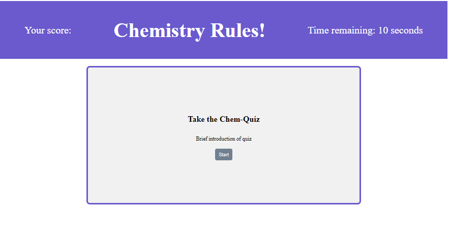

This app is a short 4 question quiz on the basics of the structure of chemical elements. When a user presses the start button, they will be presented with four multiple choice questions. They will have 10 seconds to answer each question. A timer will count down until zero. If the question is answered correctly, in the given time, the user will receive 10 points. If the answer is incorrect, or the time runs out, the user will lose 10 points. After four questions have been answered, the user will be presented with their score, asked to enter their initials, and see their initials on the score board.

Unfortunately, I was not able to successfully implement the check for the correct answer. This dominoed to running out of time before I could finish the score function, the initials input, and the score page. 

Deployed application:
https://shelleymcq.github.io/Chem-Quiz/